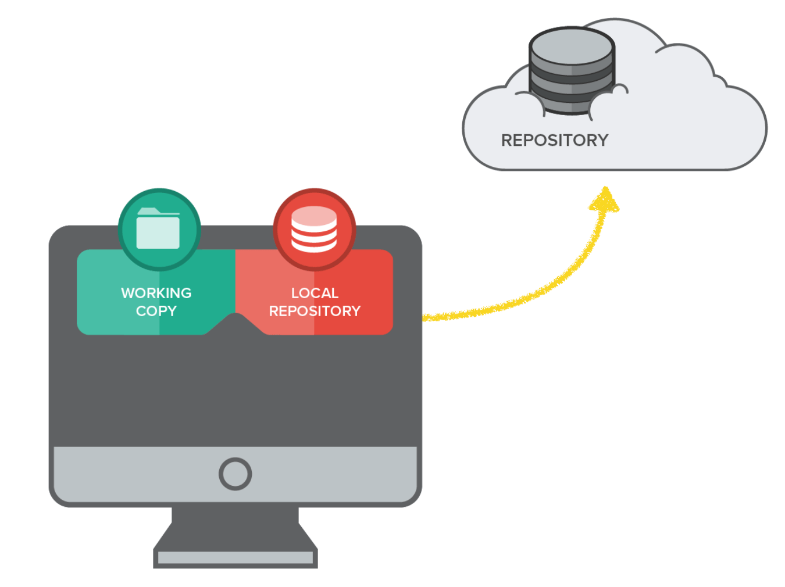

#  *GIT - это бесплатная распределенная система управления версиями с открытым исходным кодом, предназначенная для быстрой и эффективной обработки любых проектов, от небольших до очень крупных.*

* Репозиторий - это место, где хранятся и поддерживаются какие-либо данные. Чаще всего данные в репозитории хранятся в виде файлов, доступных для дальнейшего распространения по сети. Существуют репозитории для хранения программ, написанных на одном языке или предназначенных для одной платформы.

## Начальные комманды.

* **git add - Добавляет содержимое файла в индекс.**

* **git commit - Фиксирует изменение и сообщает о появлении новых версий файлов.**

* **git diff - Разница между текущей и уже зафиксированной версии файла**

* **git checkout master - вернуть текущую ветку**

* **git checkout - переходим на различные ветки**

* **clear - Очистить терминал.**
* **git log - Показать локальную работу**
* **git status - Измененные файлы**

### ***Линус Торвальдс - Финно-Американский программист,создатель операционной системы Linux,создатель GIT***

# Полезные ссылки.
[Click](https://git-scm.com/) **GIT- бесплатно**

[Click](https://code.visualstudio.com/) **VisualStudio- бесплатно**